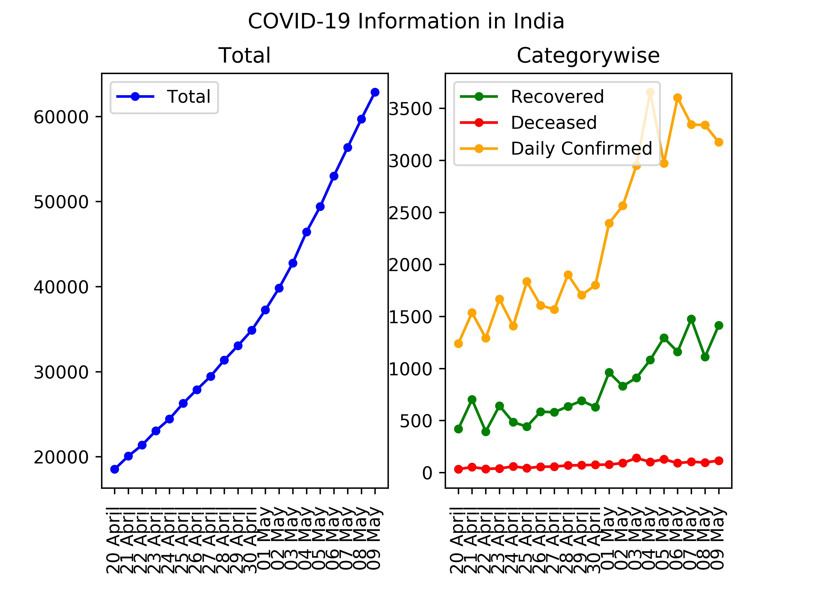
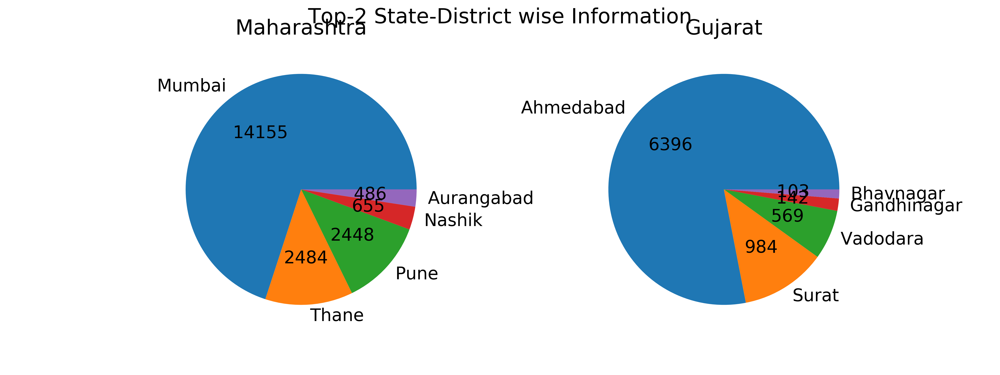
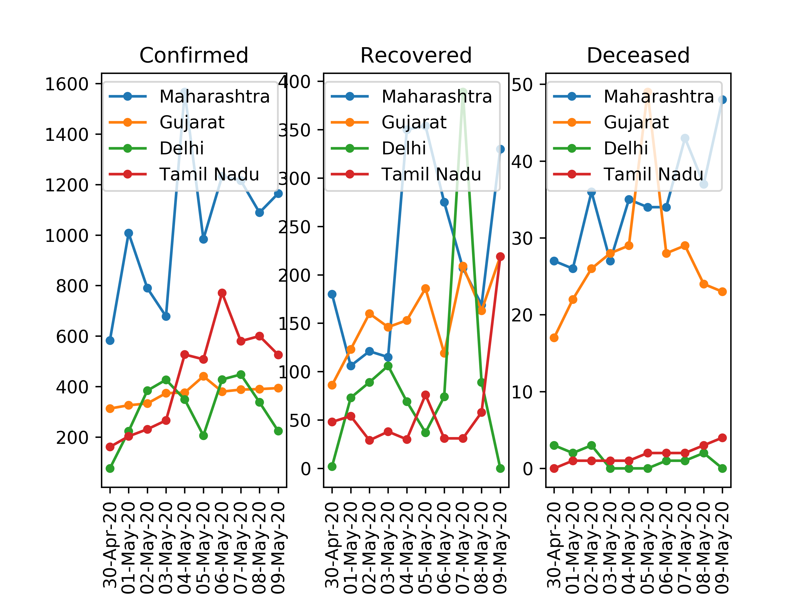

# covid19
Data visualization of covid-19 in India.
Data will be updated at runtime.

## Steps:
    1. install modules from requirement.txt
    2. run following command from root directory.
        ```
        python main.py
        ```

## Visualization:

### Timewise


### Statewise Current


### State-Districtwise


### Statewise Daily

